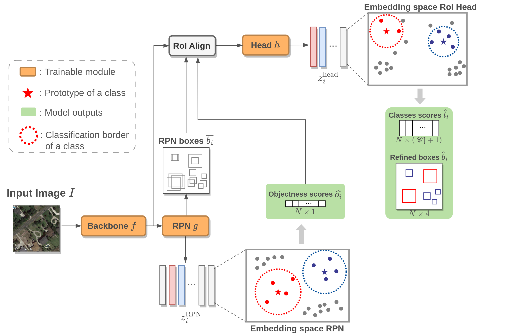

# Protoypical Faster R-CNN

#### Official code repository for paper [Experience feedback using Representation Learning for Few-Shot Object Detection on Aerial Images](https://arxiv.org/abs/2109.13027)

The code available in this repository trains a modified version of Faster R-CNN. Specifically, the classification layers in the RPN and the detection head are replaced with Prototypical Networks. Results are promising on synthetic images but mitigated on natural and aerial images. 

### Prototypical Faster R-CNN principle


```
@INPROCEEDINGS{lejeune2021experience,
  author={Le Jeune, Pierre and Lebbah, Mustapha and Mokraoui, Anissa and Azzag, Hanene},
  booktitle={2021 20th IEEE International Conference on Machine Learning and Applications (ICMLA)}, 
  title={Experience feedback using Representation Learning for Few-Shot Object Detection on Aerial Images}, 
  year={2021},
  volume={},
  number={},
  pages={662-667},
  doi={10.1109/ICMLA52953.2021.00110}}
```
